Clowder is a sophisticated AI inference orchestration system designed from the ground up to deploy, operate, and manage AI models at scale. It is an open-source framework released under the Apache 2.0 license, ensuring that it is freely available for use and modification.

Clowder consists of several components that work together to provide a complete solution for AI model management. We recommend reading the [Clowder Core Concepts](./concepts.md) to understand the terminology and concepts used in this document.

* Worker Node - physical or virtual machines that run the AI models.
* Storage Node - a storage system, local to the worker nodes, that stores the AI models and their metadata.
* Controller - software that managers the worker nodes and storage nodes, and provides an API for managing the storage and worker nodes.
* Load Balancer - LLM-aware software that intelligently routes inference requests to the worker nodes based on their load, capabilities, availability, and cache state.
* Runtime - software engine that loads the AI models into memory and executes them on the worker nodes.

And lastly:

* Kubernetes - Clowder is designed to run on Kubernetes, a container orchestration platform that provides a scalable and reliable environment for deploying and managing applications.

## Inference Request Flow

The inference request flow is as follows:

1. Administrator defines an AImage via the control plane API, providing both a source URL and a representative name, or alias, e.g. "model1".
1. User makes inference request to the API gateway, providing the alias and the input data.
1. API gateway connects to the control plane, which determines which worker node should handle the request, see above.
1. API gateway requests of storage manager on the selected node to verify that the AImage is available.
1. If the model and components are not available, controller requests of storage manager to download the AImage.
1. Storage manager responds that the AImage is available.
1. Control plane responds to API gateway with the address of the worker process on the selected node.
1. API gateway forwards request to worker process, which performs inference.

As a sequence diagram:

As a flow diagram:

```mermaid
graph TD;
    User["🧑 User"]

    API_Gateway["🔀 API Gateway"]

    Controller["🖥️ Controller"]

    subgraph Worker_Node
        Worker_Process["⚙️ Worker Process"]
        Shared_Storage[("🗄️ Shared Storage")]
        Storage_Manager["📦 Storage Manager"]
    end

    User -- 1 Inference Request --> API_Gateway
    API_Gateway -- 2 Request Worker --> Controller

    Controller -- 3 AImage check and download --> Storage_Manager
    Storage_Manager -- 4 Ensure AImage --> Shared_Storage
    Storage_Manager -- 5 AImage Available --> Controller
    Controller -- 6 Ensure Worker --> Worker_Process
    Worker_Process -- 7 Read Model --> Shared_Storage
    Controller -- 8 Worker Process Address --> API_Gateway
    API_Gateway -- 9 Inference Request --> Worker_Process
    Worker_Process -- 10 Inference Response --> API_Gateway
    API_Gateway -- 11 Inference Response --> User
```

<pre>

</pre>
